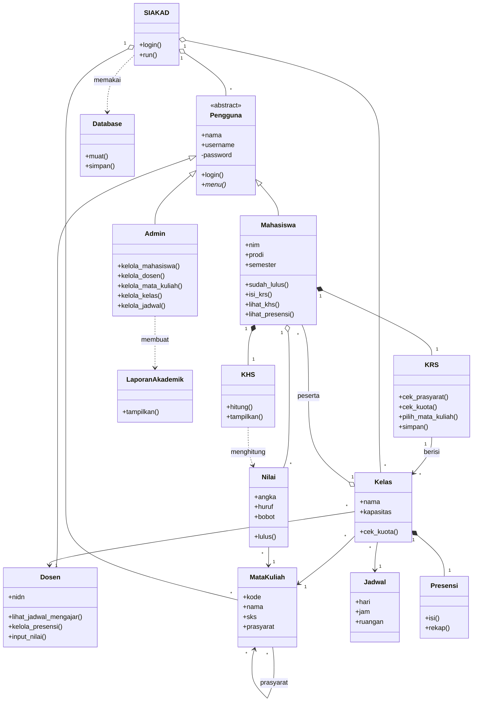

# SIAKAD (OOP)

Jalankan: `python main.py` (Python 3, tanpa install apa pun).
Data tersimpan otomatis di `data/siakad_data.json` (bisa dibuka dengan Notepad). Hapus file itu kalau mau reset ke data awal.

## Akun demo
| Peran | Username | Password |
|---|---|---|
| Mahasiswa | 230001 | 12345 |
| Dosen | D001 | 12345 |
| Admin | admin | admin123 |

## 14 Class
`Pengguna` (abstrak), `Mahasiswa`, `Dosen`, `Admin`, `MataKuliah`, `Kelas`, `Jadwal`, `KRS`, `KHS`, `Nilai`, `Presensi`, `LaporanAkademik`, `Database` (baca/tulis JSON), `SIAKAD`

## Class Diagram (relasi UML)
Salin ke https://mermaid.live untuk dijadikan gambar.

## Pembuktian konsep OOP
| Konsep | Di mana | Penjelasan singkat |
|---|---|---|
| Abstraksi | `Pengguna(ABC)` + `menu()` abstrak | Class induk yang tidak bisa dibuat langsung, hanya jadi cetakan |
| Inheritance | `Mahasiswa`, `Dosen`, `Admin` turunan `Pengguna` | Login & atribut umum ditulis sekali |
| Polymorphism | `akun.menu(self)` di `SIAKAD.run()` | Satu perintah, hasilnya beda tergantung jenis akun |
| Encapsulation | `self.__password` | Password tidak bisa diakses langsung dari luar class |
| Composition | `Mahasiswa` punya `KRS` & `KHS`, `Kelas` punya `Presensi` | Objek bagian ikut hilang jika pemiliknya hilang |
| Aggregation | `Kelas.peserta`, `Mahasiswa.nilai` | Objek bagian tetap ada walau wadahnya dihapus |
| Association | `Kelas` -> `MataKuliah`, `Dosen`, `Jadwal` | Satu objek memakai objek lain |

## Kecocokan Use Case dan Program
| Use Case | Method |
|---|---|
| Login | `SIAKAD.login()` |
| Lihat Profil | `Mahasiswa.lihat_profil()` |
| Isi KRS | `Mahasiswa.isi_krs()` |
| (include) Pilih Mata Kuliah | `KRS.pilih_mata_kuliah()` |
| (include) Cek Prasyarat | `KRS.cek_prasyarat()` |
| (include) Cek Kuota Kelas | `KRS.cek_kuota()` -> `Kelas.cek_kuota()` |
| (include) Simpan KRS | `KRS.simpan()` |
| Lihat Jadwal Kuliah | `Mahasiswa.lihat_jadwal()` |
| Lihat Nilai/KHS | `Mahasiswa.lihat_khs()` -> `KHS.tampilkan()` |
| Lihat Presensi | `Mahasiswa.lihat_presensi()` -> `Presensi.rekap()` |
| Lihat Jadwal Mengajar | `Dosen.lihat_jadwal_mengajar()` |
| Kelola Presensi | `Dosen.kelola_presensi()` |
| Input Nilai | `Dosen.input_nilai()` |
| Kelola Data Mahasiswa / Dosen / Mata Kuliah / Kelas / Jadwal | `Admin.kelola_...()` |
| Lihat Laporan Akademik | `LaporanAkademik.tampilkan()` |

## Demo
1. **Mahasiswa 230001** -> Isi KRS -> pilih `IF301 PBO Lanjut` -> **gagal: prasyarat IF202 belum lulus** (bukti Cek Prasyarat).
2. Masih di Isi KRS -> pilih `IF205 RPL` -> **gagal: kuota penuh (1/1)** (bukti Cek Kuota).
3. Lihat Nilai/KHS -> tampil IPS per semester dan IPK. Lihat Presensi dan Jadwal.
4. **Dosen D001** -> Kelola Presensi (pertemuan 2) -> Input Nilai `IF202` untuk Fabian = 90.
5. **Login ulang sebagai mahasiswa** -> KHS sekarang ada semester 3 dan IPK berubah (bukti antar-class terhubung).
6. **Admin** -> Lihat Laporan Akademik, lalu coba Tambah Mahasiswa.
7. Tutup program, buka lagi: data masih ada. Buka `data/siakad_data.json` untuk menunjukkan datanya benar-benar tersimpan.
